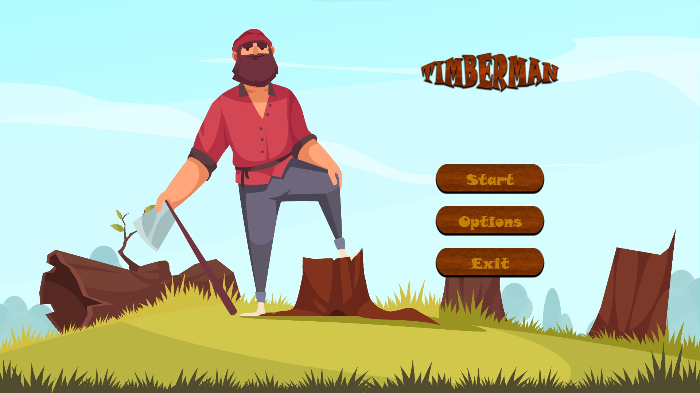
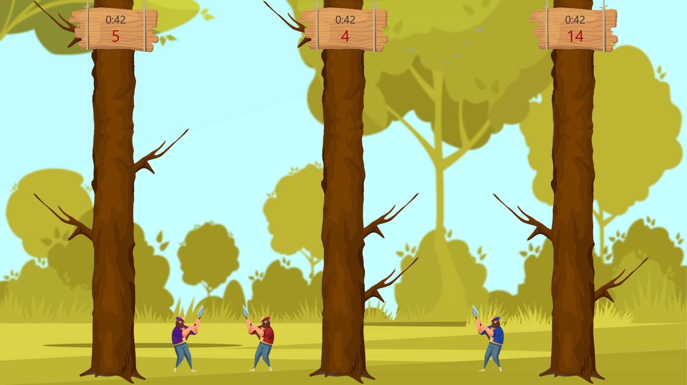

# Timberman multiplayer
Project for KCK classes

# GUI presentation

# Credits
- Graphic 
  - GameWindow:
    - background - <a href="https://www.freepik.com/vectors/woodcutter">Woodcutter vector created by macrovector - www.freepik.com</a>
    - playerCharacter - <a href='https://www.freepik.com/vectors/woodcutter'>Woodcutter vector created by macrovector - www.freepik.com</a>
    - tree - <a href='https://www.freepik.com/vectors/log'>Log vector created by pch.vector - www.freepik.com</a>
    - woodSign <a href='https://pl.freepik.com/wektory/drewno'>Drewno plik wektorowy utworzone przez pch.vector - pl.freepik.com</a>
  - StartWindow:
    - background - <a href='https://www.freepik.com/vectors/woodcutter'>Woodcutter vector created by macrovector - www.freepik.com</a>
- Sounds -
  - music - 
  - throwSound  - https://Zapsplat.com
  - damageSound - https://mixkit.co/